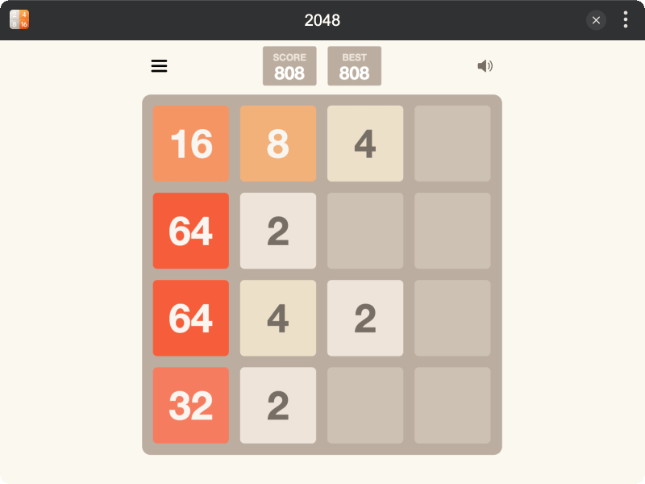
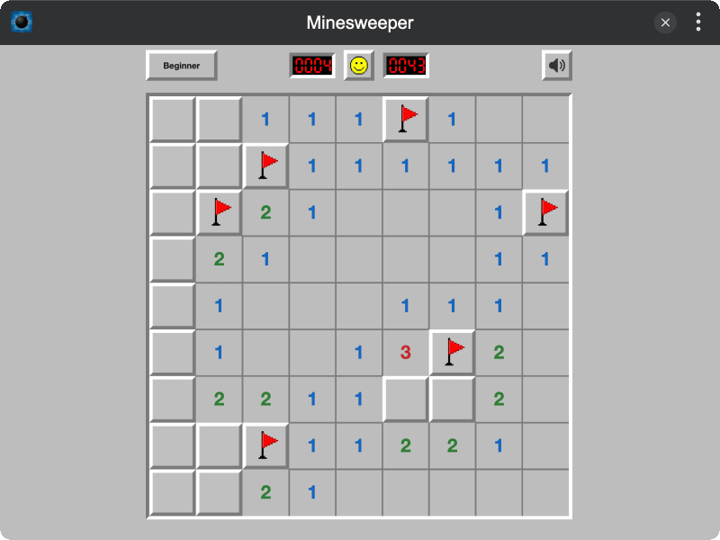

# TINKER Official Games

This repository contains officially maintained non-built-in [TINKER](https://github.com/liriliri/tinker) game plugins.

## Games

All games in the list can be installed to TINKER by running `npm i -g tinker-xxx`.

<table width="100%" style="text-align:center">
  <tbody>
    <tr>
      <th width="50%"><a href="./packages/tinker-2048/">tinker-2048</a></th>
      <th><a href="./packages/tinker-minesweeper/">tinker-minesweeper</a></th>
    </tr>
    <tr>
      <th></th>
      <th></th>
    </tr>
  </tbody>
</table>
